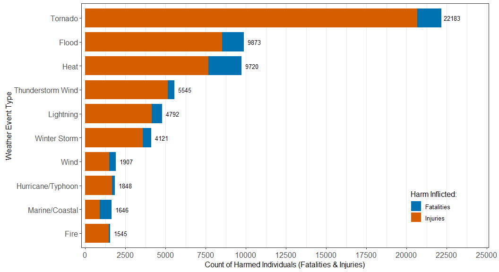
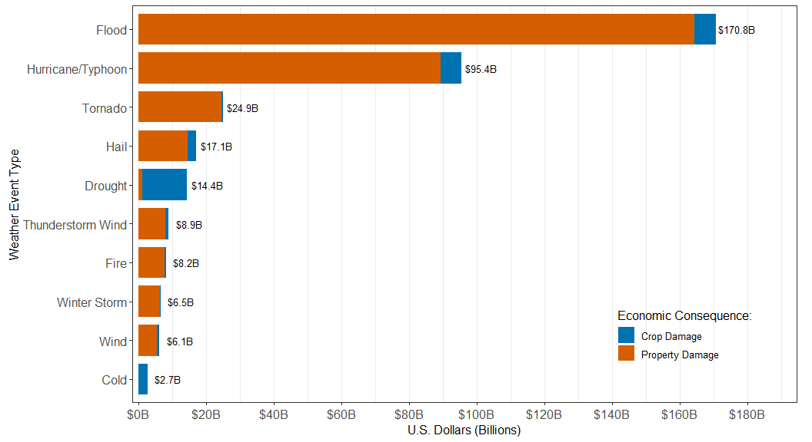

# Synopsis


# Data Acquisition


``` r
library(tidyverse)
library(data.table)
```

The "repdata_data_StormData.csv" file holds 902,297 rows and 37 columns. Hence, data.table::fread() will be used to read in the data, which is faster than read.csv() and read_csv().


``` r
dt <- fread(cmd = "bzip2 -dc repdata_data_StormData.csv.bz2", 
            header = T, sep = ",", showProgress = F)
```

# Data Profiling

The inspection will be held through the prism of the relevant columns for this project:

- BGN_DATE, which represents the day the weather event started.
- EVTYPE, which represents the type of the weather event.
- FATALITIES & INJURIES, which are the counts of direct human deaths and injuries attributed to the event, respectively.
- PROPDMG & PROPDMGEXP, which are the estimated property damage and its exponent, respectively.
- CROPDMG & CROPDMGEXP, which are the estimated crop damage and its exponent, respectively.

<u>Important Note</u>:

- As explained in the [Storm Data FAQ Page](https://www.ncei.noaa.gov/stormevents/faq.jsp)(Section:"How are tornadoes counted?"), the health and economic consequences for **multi-county events** (major weather events crossing many counties) are segmented. In other words, when an event crosses many counties the **consequences** of that event are **spread across the respective rows of the different counties the event crosses**. That way, all multi-county events are treated as **separate events** that occur in different counties, where each row that belongs to the same multi-county event carries its own consequences (instead of recycled aggregates representing the total amounts). Hence, during the preprocessing stage, grouping and aggregation will occur so that the overall impact of each event type can be calculated.


``` r
relevant_column_names <- c("BGN_DATE","EVTYPE", "FATALITIES", "INJURIES", 
                           "PROPDMG", "PROPDMGEXP", "CROPDMG", "CROPDMGEXP")
```

Transposed summary of the data.table:

``` r
glimpse(dt[, ..relevant_column_names])
```

```
## Rows: 902,297
## Columns: 8
## $ BGN_DATE   <chr> "4/18/1950 0:00:00", "4/18/1950 0:00:00", "2/20/1951 0:00:0~
## $ EVTYPE     <chr> "TORNADO", "TORNADO", "TORNADO", "TORNADO", "TORNADO", "TOR~
## $ FATALITIES <dbl> 0, 0, 0, 0, 0, 0, 0, 0, 1, 0, 0, 0, 1, 0, 0, 4, 0, 0, 0, 0,~
## $ INJURIES   <dbl> 15, 0, 2, 2, 2, 6, 1, 0, 14, 0, 3, 3, 26, 12, 6, 50, 2, 0, ~
## $ PROPDMG    <dbl> 25.0, 2.5, 25.0, 2.5, 2.5, 2.5, 2.5, 2.5, 25.0, 25.0, 2.5, ~
## $ PROPDMGEXP <chr> "K", "K", "K", "K", "K", "K", "K", "K", "K", "K", "M", "M",~
## $ CROPDMG    <dbl> 0, 0, 0, 0, 0, 0, 0, 0, 0, 0, 0, 0, 0, 0, 0, 0, 0, 0, 0, 0,~
## $ CROPDMGEXP <chr> "", "", "", "", "", "", "", "", "", "", "", "", "", "", "",~
```

NAs:

``` r
naniar::miss_var_summary(dt[, ..relevant_column_names])
```

```
## # A tibble: 8 x 3
##   variable   n_miss pct_miss
##   <chr>       <int>    <num>
## 1 BGN_DATE        0        0
## 2 EVTYPE          0        0
## 3 FATALITIES      0        0
## 4 INJURIES        0        0
## 5 PROPDMG         0        0
## 6 PROPDMGEXP      0        0
## 7 CROPDMG         0        0
## 8 CROPDMGEXP      0        0
```
The 8 relevant columns do not contain any NAs.

Check for the existence of duplicate records:

``` r
janitor::get_dupes(dt)
```

```
## No variable names specified - using all columns.
```

```
## No duplicate combinations found of: STATE__, BGN_DATE, BGN_TIME, TIME_ZONE, COUNTY, COUNTYNAME, STATE, EVTYPE, BGN_RANGE, ... and 28 other variables
```

```
## Empty data.table (0 rows and 38 cols): STATE__,BGN_DATE,BGN_TIME,TIME_ZONE,COUNTY,COUNTYNAME...
```
There are no duplicates in "dt".

Data summary by relevant variable:

``` r
skimr::skim(dt[, ..relevant_column_names])
```


Table: Data summary

|                         |                             |
|:------------------------|:----------------------------|
|Name                     |dt[, ..relevant_column_na... |
|Number of rows           |902297                       |
|Number of columns        |8                            |
|Key                      |NULL                         |
|_______________________  |                             |
|Column type frequency:   |                             |
|character                |4                            |
|numeric                  |4                            |
|________________________ |                             |
|Group variables          |None                         |


**Variable type: character**

|skim_variable | n_missing| complete_rate| min| max|  empty| n_unique| whitespace|
|:-------------|---------:|-------------:|---:|---:|------:|--------:|----------:|
|BGN_DATE      |         0|             1|  16|  18|      0|    16335|          0|
|EVTYPE        |         0|             1|   1|  30|      0|      985|          0|
|PROPDMGEXP    |         0|             1|   0|   1| 465934|       19|          0|
|CROPDMGEXP    |         0|             1|   0|   1| 618413|        9|          0|


**Variable type: numeric**

|skim_variable | n_missing| complete_rate|  mean|    sd| p0| p25| p50| p75| p100|hist                                     |
|:-------------|---------:|-------------:|-----:|-----:|--:|---:|---:|---:|----:|:----------------------------------------|
|FATALITIES    |         0|             1|  0.02|  0.77|  0|   0|   0| 0.0|  583|<U+2587><U+2581><U+2581><U+2581><U+2581> |
|INJURIES      |         0|             1|  0.16|  5.43|  0|   0|   0| 0.0| 1700|<U+2587><U+2581><U+2581><U+2581><U+2581> |
|PROPDMG       |         0|             1| 12.06| 59.48|  0|   0|   0| 0.5| 5000|<U+2587><U+2581><U+2581><U+2581><U+2581> |
|CROPDMG       |         0|             1|  1.53| 22.17|  0|   0|   0| 0.0|  990|<U+2587><U+2581><U+2581><U+2581><U+2581> |

Observations from the summary statistics:

- The "EVTYPE" column holds 985 unique values, whereas the number of major weather events is significantly  smaller (48). This points to naming inconsistencies.
- Most values in the "PROPDMGEXP" and "CROPDMGEXP" columns are empty, signifying that most of the provided numbers in "PROPDMG" and "CROPDMG" are multiplied by 1 (dollars, rather than thousands or millions of dollars)
- All four numeric columns follow a zero-inflated distribution, that is, a distribution that has a substantial spike at zero and a long right tail of non-zero values.

Unique values of the "PROPDMGEXP" column:

``` r
unique(dt$PROPDMGEXP)
```

```
##  [1] "K" "M" ""  "B" "m" "+" "0" "5" "6" "?" "4" "2" "3" "h" "7" "H" "-" "1" "8"
```

Unique values of the "CROPDMGEXP" column:

``` r
unique(dt$CROPDMGEXP)
```

```
## [1] ""  "M" "K" "m" "B" "?" "0" "k" "2"
```

# Data Preprocessing

## Description of the Preprocessing Pipeline

Steps in the Preprocessing Pipeline:

1. Rename the Columns
2. Preprocess the "BGN_DATE" column
   - Convert to Date
   - Filter out records before 01/01/1996
3. Clean the "EVTYPE" Column
   - Remove trailing and leading whitespaces
   - Convert to title case
   - Use str_extract() for automatic and bulk transformation of most unique 
   values of the column.
   - Use fcase() to manually group the unique values from the output of 
   str_extract().
   - Filter out unique values associated with data entry errors or general terms. 
4. Create two derived columns holding the total property and agricultural damages 
   - Multiply the damages by their multiplier, which is calculated by 
   applying the "exponent_to_multiplier" function to the "PROPDMGEXP" and 
   "CROPDMGEXP" columns.
5. Remove the NAs step 4. produced.
6. Group by the "EVTYPE" column and calculate summary statistics.

## Note regarding the "BGN_DATE" column

Why filter out records before 01/01/1996?

- Because [NOAA](https://www.ncei.noaa.gov/stormevents/faq.jsp) didn't begin recording all weather event types until that date.
- More specifically, before 1996, only Tornado, Thunderstorm Wind, and Hail data were collected.
- The recording of all other weather events presented in the [storm data event table](https://d396qusza40orc.cloudfront.net/repdata%2Fpeer2_doc%2Fpd01016005curr.pdf)(p.6) began after 1996.
- Considering that, including dates before 1996 could potentially skew the analysis toward these event types.

## Supporting Objects

### Related to str_extract()

The values of both the "types" and "extra_types" vectors that follow will be used as patterns for the extraction and transformation of all 985 unique values of the "EVTYPE" column through the utilization of the stringr::str_extract() function.

The "types" vector holds all 48 unique weather event types from the [storm data event table](https://d396qusza40orc.cloudfront.net/repdata%2Fpeer2_doc%2Fpd01016005curr.pdf)(p.6):

``` r
types <- c(
  "Astronomical Low Tide", "Avalanche", "Blizzard", "Coastal Flood",
  "Cold/Wind Chill", "Debris Flow", "Dense Fog", "Dense Smoke",
  "Drought", "Dust Devil", "Dust Storm", "Excessive Heat",
  "Extreme Cold/Wind Chill", "Flash Flood", "Frost/Freeze",
  "Funnel Cloud", "Freezing Fog","Heavy Rain", "Heavy Snow", "High Surf",
  "Hurricane \\(Typhoon\\)", "Ice Storm", "Lake-Effect Snow", "Lakeshore Flood",
  "Lightning", "Marine Hail", "Marine High Wind", "Marine Strong Wind",
  "Marine Thunderstorm Wind", "Rip Current", "Seiche", "Sleet",
  "Storm Surge/Tide", "Strong Wind", "Thunderstorm Wind", "Tornado",
  "Tropical Depression", "Tropical Storm", "Tsunami", "Volcanic Ash", "High Wind",
  "Waterspout", "Wildfire", "Winter Storm", "Winter Weather", "Flood", "Hail", "Heat"
)
```

The "extra_types" vector contains the patterns required to extract the remaining unique values of the "EVTYPE" column:

``` r
extra_types <- c(
        #--- Rare Entries -----------------------------------------------------#
        "Dam", "Typhoon", "Volcanic", "Drowning","Smoke", "Vog", "Turbulence",
        "Hypothermia", "Hyperthermia", "Remnants", "Northern Lights", "Landslump", 
        "Rock Slide", "Excessive", "Driest", "None", "Wnd", "Apache", "Southeast", 
        "Metro", "Red Flag", "Wall Cloud", "Freezing Drizzle", "Freezing Spray",
        #--- Misspellings -----------------------------------------------------#
        "Lighting", "Ligntning", "Tunderstorm", "Thundestorm", "Thuderstorm",
        "Thundeerstorm", "Thunerstorm", "Mircoburst", "Micoburst", "Floo", 
        "Avalance", "Torndao",
        #--- Single-Word Patterns ---------------------------------------------#
        "Summary", "\\?", "Other", "Tstm", "Snow", "Rain",
        "Cold", "Hurricane", "Thunderstorm", "Ice", "Freeze", 
        "Frost", "Fire", "Mud", "Funnel", "Fog", "Microburst", "Warm", "Dry",
        "Wet", "Hot", "Cool", "Tide", "Surf", "Swell", "Wave", "Surge", "Dust", 
        "Spout", "Precip","Glaze", "Mix", "Urban", "Erosion", "Record", "Temp", 
        "Landslide", "Shower", "Marine", "Downburst", "Gustnado", "Mild", "Sea", 
        "Stream", "Beach", "Water", "Icy", "Storm", "Wind", "Severe", "High"
)
```

Regex Matching Notes:

- "Spout" will match both "Waterspout" and "Landspout".
- "Precip" will match "Precipitation" and the misspelled "Precipatation".
- "Mix" will match "Wintry Mix", "Wintery Mix", "Winter Mix", and "Heavy Mix".
- "Marine" will match "Marine Mishap" and "Marine Accident".
- "Sea" will match "High Seas", "Heavy Seas", and "Rough Seas".
- "Stream" will match "Small Stream" and "Sml Stream Fld".
- "Beach" will match "Beach Erosion" and the misspelled "Beach Erosin".
- "Water" will match "High Water" and "Rapidly Rising Water".
- "Icy" will match "Icy Roads" ("Ice" ≠ "Icy").
- "Red Flag", will match "Red Flag Fire Wx" and "Red Flag Criteria".

Pattern for regex matching:

``` r
pattern <- str_c(c(types, extra_types), collapse = "|")
```

### Related to the Recoding of the "EVTYPE" Column

The following vectors are used to group similar weather events (with fcase()) to further reduce the number of unique values of the "EVTYPE" column after the application of the stringr::str_extract() function:

``` r
thunderstorm_vals <- c(
  "Thunderstorm Wind", "Thunderstorm", "Tstm", "Marine Thunderstorm Wind",
  "Tunderstorm", "Thundestorm", "Thuderstorm", "Thundeerstorm", "Thunerstorm",
  "Microburst", "Mircoburst", "Micoburst", "Downburst"
)

lightning_vals <- c("Lightning","Lighting", "Ligntning")

tornado_vals <- c(
  "Tornado", "Waterspout", "Funnel Cloud", "Funnel",
  "Spout", "Wall Cloud", "Gustnado", "Torndao", "spout"
)

flood_vals <- c(
  "Flash Flood", "Flood", "Lakeshore Flood", "Coastal Flood", "flood",
  "Storm Surge/Tide", "Surge", "Dam", "Urban", "Stream", "Water", "Floo"
)

wind_vals <- c("High Wind", "Strong Wind", "Wind", "Wnd", "wind", 
               "Marine High Wind", "Marine Strong Wind")

hail_vals <- c("Marine Hail", "Hail")

winter_snow_vals <- c(
  "Heavy Snow", "Blizzard", "Winter Storm", "Winter Weather",
  "Lake-Effect Snow", "Snow", "snow" ,"Ice Storm", "Sleet",
  "Ice", "Glaze", "Mix", "Icy"
)

cold_vals <- c(
  "Cold/Wind Chill", "Extreme Cold/Wind Chill", "Cold", "Cool",
  "Hypothermia", "Frost/Freeze", "Frost", "Freeze"
)

hurricane_tropical_vals <- c(
  "Hurricane (Typhoon)", "Typhoon", "Hurricane",
  "Tropical Storm", "Tropical Depression", "Remnants"
)

heat_vals <- c("Excessive Heat", "Heat", "Hot", "Warm", "Hyperthermia")

drought_vals <- c("Drought", "Dry", "Driest")

fog_vals <- c("Dense Fog", "Fog", "Freezing Fog")

smoke_vals <- c("Dense Smoke", "Smoke")

rain_vals <- c("Heavy Rain", "Rain", "Shower", "Wet", 
               "Precip", "Freezing Drizzle")

wildfire_vals <- c("Wildfire", "Fire")

avalanche_vals <- c("Avalanche", "Avalance")

landslide_vals <- c("Landslide", "Debris Flow", "Mud", "Rock Slide", "Landslump")

dust_vals <- c("Dust Devil", "Dust Storm", "Dust")

volcanic_vals <- c("Volcanic Ash", "Volcanic","Vog")

marine_coastal_vals <- c(
  "Rip Current", "High Surf", "Surf", "Swell", "Wave", "Astronomical Low Tide",
  "Sea", "sea", "Beach", "Tide", "Freezing Spray", "Tsunami", "Seiche",
  "Marine", # "Marine Mishap" and "Marine Accident"
  "Erosion" # Coastal Erosion
)
```

Note that NOAA separates "Thunderstorm Wind" and "Lightning" on the basis that they
are different hazards, even though both categories belong to the same storm system. Regarding the former, the health or economic consequences are caused by the wind of the storm. Regarding the latter, the health or economic consequences are caused by a lightning strike.

Note that marinal weather events are spread across different groups. This should be changed for marine vs land analysis, but suffices for this project.

- Most marinal weather events are part of the "Marine/Coastal" group. 
- "Marine Thunderstorm Wind" is part of the "Thunderstorm" group.
- "Marine High Wind" and "Marine Strong Wind" are part of the "wind" group. 
- "Marine Hail" is part of the "Hail" group.

The following strings are values that are not grouped (that is, values that pass through fcase() unchanged via the default parameter):

- "Drowning", "Northern Lights", "Storm", "Severe","High", "Mild", "Record"
- "Temp", "None", "Summary", "Other", "Apache", "Southeast", "Metro", "Excessive"
- "Red Flag", "Turbulence"

These values mostly represent data entry errors or very generic terms that could be attached to many different weather events.

All of the above values that do not belong to a group are filtered out except for the "Turbulence" value.

The "filter_out_vals" vector holds the abovementioned values (excluding "Turbulence"):

``` r
filter_out_vals <- c(
        "Drowning", "Northern Lights", "Storm", "Severe","High", "Mild", "Record", 
        "Temp", "None", "Summary","Other", "Apache", "Southeast", "Metro", 
        "Excessive", "Red Flag", "storm"
) 
```

Recoding Function for the "EVTYPE" column:

``` r
recode_event_type <- function(event_type){
        fcase(
                event_type %chin% thunderstorm_vals,       "Thunderstorm Wind",
                event_type %chin% lightning_vals,          "Lightning",
                event_type %chin% tornado_vals,            "Tornado",
                event_type %chin% flood_vals,              "Flood",
                event_type %chin% wind_vals,               "Wind",
                event_type %chin% hail_vals,               "Hail",
                event_type %chin% winter_snow_vals,        "Winter Storm",
                event_type %chin% cold_vals,               "Cold",
                event_type %chin% hurricane_tropical_vals, "Hurricane/Typhoon",
                event_type %chin% heat_vals,               "Heat",
                event_type %chin% drought_vals,            "Drought",
                event_type %chin% fog_vals,                "Fog",
                event_type %chin% smoke_vals,              "Smoke",
                event_type %chin% rain_vals,               "Heavy Rain",
                event_type %chin% wildfire_vals,           "Fire",
                event_type %chin% avalanche_vals,          "Avalanche",
                event_type %chin% landslide_vals,          "Landslide",
                event_type %chin% dust_vals,               "Dust Storm",
                event_type %chin% volcanic_vals,           "Volcanic Ash",
                event_type %chin% marine_coastal_vals,     "Marine/Coastal",
                default = event_type
        )
}
```

### Related to the Recoding of the "PROPDMGEXP" and "CROPDMGEXP" Columns

Recoding Function for the "PROPDMGEXP" and "CROPDMGEXP" columns:

``` r
exponent_to_multiplier <- function(exp){
        fcase(
                exp %chin% c("H" , "h"), 1e2,
                exp %chin% c("K" , "k"), 1e3,
                exp %chin% c("M", "m"), 1e6,
                exp %chin% c("B"), 1e9,
                default = 0 # all digits from 0 to 8, "+" , "?", "-", & ""
        )
}
```

## Preprocessing Pipeline


``` r
setnames(dt, relevant_column_names, 
         c("begin_date","event_type", "fatalities", "injuries", "property_damage", 
           "property_damage_exponent", "crop_damage", "crop_damage_exponent")
         )

invisible(dt[ 
        , `:=`(
                begin_date = as_date(mdy_hms(begin_date)),
                event_type = str_to_title(str_trim(event_type, side = "both"))
        )
])
```


``` r
results <- dt[
        begin_date >= mdy("01/01/1996")
][
        , event_type := str_extract(event_type, regex(pattern, ignore_case = T))
][
        , event_type := recode_event_type(event_type)
][
        !(event_type %chin% filter_out_vals)
][
        , `:=`(
                total_property_damage = 
                        property_damage * 
                        exponent_to_multiplier(property_damage_exponent),
                total_crop_damage = 
                        crop_damage * 
                        exponent_to_multiplier(crop_damage_exponent)
        )
][
        , .(
                count = .N,
                fatalities_per_type = sum(fatalities),
                injuries_per_type = sum(injuries),
                total_property_damage_per_type = sum(total_property_damage),
                total_crop_damage_per_type = sum(total_crop_damage)
        ), by = event_type
][
        , `:=`(
                health_consequences_per_type = fatalities_per_type + injuries_per_type,
                damages_per_type = 
                        total_property_damage_per_type + total_crop_damage_per_type 
        )
][
        order(-health_consequences_per_type, -damages_per_type)
]
```

## Validation

Check whether the transformation of the "EVTYPE/"event_type" column was successful. 
There should only exist 20 unique values (levels later) of that column, 
all stemming from the application of the "recode_event_type" recoding function in the previous preprocessing pipeline.

``` r
unique(results$event_type)
```

```
##  [1] "Tornado"           "Flood"             "Heat"             
##  [4] "Thunderstorm Wind" "Lightning"         "Winter Storm"     
##  [7] "Wind"              "Hurricane/Typhoon" "Marine/Coastal"   
## [10] "Fire"              "Fog"               "Hail"             
## [13] "Cold"              "Dust Storm"        "Avalanche"        
## [16] "Heavy Rain"        "Landslide"         "Drought"          
## [19] "Volcanic Ash"      "Smoke"
```


``` r
glimpse(results)
```

```
## Rows: 20
## Columns: 8
## $ event_type                     <chr> "Tornado", "Flood", "Heat", "Thundersto~
## $ count                          <int> 32618, 79727, 2410, 217013, 13204, 3967~
## $ fatalities_per_type            <dbl> 1513, 1348, 2035, 389, 651, 530, 401, 1~
## $ injuries_per_type              <dbl> 20670, 8525, 7685, 5156, 4141, 3591, 15~
## $ total_property_damage_per_type <dbl> 24622817010, 164399831670, 9243700, 791~
## $ total_crop_damage_per_type     <dbl> 283425010, 6383043200, 492578500, 10169~
## $ health_consequences_per_type   <dbl> 22183, 9873, 9720, 5545, 4792, 4121, 19~
## $ damages_per_type               <dbl> 24906242020, 170782874870, 501822200, 8~
```


``` r
if_else(all(naniar::miss_var_summary(results)$n_miss) == 0, "No Missing Values", "NAs Present")
```

```
## [1] "No Missing Values"
```

``` r
if_else(nrow(suppressMessages(janitor::get_dupes(results))) == 0, "No Duplicates", "Duplicates Present") 
```

```
## [1] "No Duplicates"
```

# Results

Convert the "results" data.table to tibble to facilitate further exploration, since "results" now only contains 20 rows and 8 columns:

``` r
results <- results |> as_tibble()
```

## Health Consequences

Create the tibble that will hold the data for all health consequences:

``` r
health_consequences <- results |> 
        select(event_type, count, fatalities_per_type, injuries_per_type, 
               health_consequences_per_type) |> 
        arrange(desc(health_consequences_per_type)) |> 
        mutate(event_type = as_factor(event_type))
health_consequences
```

```
## # A tibble: 20 x 5
##    event_type         count fatalities_per_type injuries_per_type
##    <fct>              <int>               <dbl>             <dbl>
##  1 Tornado            32618                1513             20670
##  2 Flood              79727                1348              8525
##  3 Heat                2410                2035              7685
##  4 Thunderstorm Wind 217013                 389              5156
##  5 Lightning          13204                 651              4141
##  6 Winter Storm       39679                 530              3591
##  7 Wind               24547                 401              1506
##  8 Hurricane/Typhoon   1015                 182              1666
##  9 Marine/Coastal      8432                 740               906
## 10 Fire                4176                  87              1458
## 11 Fog                 1774                  69               855
## 12 Hail              208210                   7               723
## 13 Cold                3727                 380               130
## 14 Dust Storm           559                  13               415
## 15 Avalanche            378                 223               156
## 16 Heavy Rain         11859                 102               249
## 17 Landslide            620                  43                55
## 18 Drought             2634                   3                29
## 19 Volcanic Ash          30                   0                 0
## 20 Smoke                 21                   0                 0
## # i 1 more variable: health_consequences_per_type <dbl>
```


``` r
cap1 <- "Weather event types that are most harmful to population health across the U.S. from 1996-01-01 to 2011-11-30"
knitr::opts_current$set(fig.cap = cap1)
```

```
## Warning in set2(resolve(...)): The object is read-only and cannot be modified.
## If you have to modify it for a legitimate reason, call the method $lock(FALSE)
## on the object before $set(). Using $lock(FALSE) to modify the object will be
## enforced in future versions of knitr and this warning will become an error.
```

``` r
health_consequences |> 
        select(-count) |> 
        slice_head(n = 10) |> 
        pivot_longer(cols = c(fatalities_per_type, injuries_per_type), 
                     names_to = "component", 
                     values_to = "value") |> 
        mutate(component = factor(component, 
                                  levels = c("fatalities_per_type", "injuries_per_type"))) |> # flipped in a horizontal bar chart
        ggplot(aes(x = value, y = fct_rev(event_type), fill = component)) +
        geom_bar(stat = "identity", position = "stack", width = 0.8) +
        geom_text(
                data = health_consequences |> slice_head(n = 10), # Original wide data (1 row per bar)
                aes(
                        x = health_consequences_per_type, 
                        y = fct_rev(event_type),
                        label = health_consequences_per_type,
                ),
                inherit.aes = F, # detach from parent aes() so fill & component don't interfere 
                size = 3.5, nudge_x = 650
        ) + 
        scale_x_continuous(expand = expansion(mult = c(0.01, 0.1)),
                           breaks = seq(from = 0, to = 25000, by = 2500)) +
        scale_fill_manual(name = "Harm Inflicted:",
                          values = c("fatalities_per_type" = "#0072B2", "injuries_per_type" = "#D55E00"), # Blue & Vermillion
                          labels = c("fatalities_per_type" = "Fatalities", "injuries_per_type" = "Injuries")
        ) + 
        labs(x = "Count of Harmed Individuals (Fatalities & Injuries)", y = "Weather Event Type") +
        theme_bw(base_size = 12) + 
        theme(
                axis.text = element_text(size = 12),
                legend.position = c(0.865,0.17),
                legend.background = element_blank(),
                legend.key = element_blank(),
                plot.margin = margin(6, 16, 6, 8),
                panel.grid.major.y = element_blank()
        )
```



Health Consequences Insights:

- Tornadoes top the list of the most health consequences with a total number of 22183 fatalities and injuries.
- Floods and heat follow with half the count of the "Tornado" event type with regard to fatalities and injuries.
(9873 and 9720, respectively).
- Thunderstorm winds, lightning, and winter storms are also dangerous, having harmed 5545, 4792, and 4121 people, respectively. 
- Heat, even though it is observed at least one order of magnitude less often (2410 records) 
than the other event types that top the list, is responsible for the most deaths
out of all event types (2035); Tornadoes and Floods follow (1513 and 1348, respectively).

## Economic Consequences

Create the tibble that will hold the data for all economic consequences:

``` r
economic_consequences <- results |> 
        select(event_type, count, total_property_damage_per_type, 
               total_crop_damage_per_type, damages_per_type) |> 
        mutate(
                total_property_damage_per_type = total_property_damage_per_type/1e9,
                total_crop_damage_per_type = total_crop_damage_per_type/1e9,
                damages_per_type = damages_per_type/1e9
                ) |> 
        arrange(desc(damages_per_type)) |> 
        mutate(event_type = as_factor(event_type))
economic_consequences
```

```
## # A tibble: 20 x 5
##    event_type         count total_property_damage_per_t~1 total_crop_damage_pe~2
##    <fct>              <int>                         <dbl>                  <dbl>
##  1 Flood              79727                     164.                     6.38   
##  2 Hurricane/Typhoon   1015                      89.4                    6.03   
##  3 Tornado            32618                      24.6                    0.283  
##  4 Hail              208210                      14.6                    2.50   
##  5 Drought             2634                       1.05                  13.4    
##  6 Thunderstorm Wind 217013                       7.91                   1.02   
##  7 Fire                4176                       7.76                   0.402  
##  8 Winter Storm       39679                       6.41                   0.121  
##  9 Wind               24547                       5.43                   0.716  
## 10 Cold                3727                       0.0417                 2.64   
## 11 Heavy Rain         11859                       0.600                  0.730  
## 12 Lightning          13204                       0.743                  0.00690
## 13 Heat                2410                       0.00924                0.493  
## 14 Landslide            620                       0.327                  0.0200 
## 15 Marine/Coastal      8432                       0.264                  0.0402 
## 16 Fog                 1774                       0.0226                 0      
## 17 Dust Storm           559                       0.00616                0.0031 
## 18 Avalanche            378                       0.00371                0      
## 19 Volcanic Ash          30                       0.0005                 0      
## 20 Smoke                 21                       0.0001                 0      
## # i abbreviated names: 1: total_property_damage_per_type,
## #   2: total_crop_damage_per_type
## # i 1 more variable: damages_per_type <dbl>
```


``` r
cap2 <- "Weather event types with the greatest economic consequences across the U.S. from 1996-01-01 to 2011-11-30"
knitr::opts_current$set(fig.cap = cap2)
```

```
## Warning in set2(resolve(...)): The object is read-only and cannot be modified.
## If you have to modify it for a legitimate reason, call the method $lock(FALSE)
## on the object before $set(). Using $lock(FALSE) to modify the object will be
## enforced in future versions of knitr and this warning will become an error.
```

``` r
wide_economic_consequences <- economic_consequences |> slice_head(n = 10)

long_economic_consequences <- economic_consequences |> 
        select(-count) |> 
        slice_head(n = 10) |> 
        pivot_longer(cols = c(total_property_damage_per_type, total_crop_damage_per_type), 
                     names_to = "component",
                     values_to = "value") |> 
        mutate(component = factor(component, 
                                  levels = c("total_crop_damage_per_type", 
                                             "total_property_damage_per_type")))

long_economic_consequences |> 
        ggplot(aes(x = value, y = fct_rev(event_type), fill = component)) +
        geom_bar(stat = "identity", position = "stack", width = 0.8) +
        geom_text(
                data = wide_economic_consequences,
                aes(
                        x = damages_per_type,
                        y = fct_rev(event_type),
                        label = scales::dollar(damages_per_type, 
                                               accuracy = 0.1, suffix = "B")
                ),
                inherit.aes = F, size = 3.5, nudge_x = 6
        ) + 
        scale_x_continuous(expand = expansion(mult = c(0.01, 0.1)),
                           breaks = seq(from = 0, to = 180, by = 20),
                           labels = scales::label_dollar(suffix = "B")) +
        scale_fill_manual(name = "Economic Consequence:",
                          values = c("total_crop_damage_per_type" = "#0072B2", 
                                     "total_property_damage_per_type" = "#D55E00"),
                          labels = c("total_crop_damage_per_type" = "Crop Damage", 
                                     "total_property_damage_per_type" = "Property Damage")
        ) + 
        labs(x = "U.S. Dollars (Billions)", y = "Weather Event Type") +
        theme_bw(base_size = 12) + 
        theme(
                axis.text = element_text(size = 12),
                legend.position = c(0.832,0.17),
                legend.background = element_blank(),
                legend.key = element_blank(),
                plot.margin = margin(6, 15, 6, 8),
                panel.grid.major.y = element_blank()
        )
```



Economic Consequences Insights:

- Floods are unquestionably the most harmful financially, causing a total of 170.8 billion dollars in damages (property and crop damages).
   - More specifically, the "Flood" type is second regarding the total crop damages it causes (\$6.4B) and first with regard to the total property damages it is responsible for (\$164.4B). 
- Hurricanes, even though they appear infrequently in the database (1015 records), are second in the list, resulting in 95.4 billion dollars of total damages.
- The previous weather events are followed by tornadoes (\$24.9B) and hail (\$17.1B), and drought (\$14.4B).
- Even though drought is observed less often (2634 records) and it is the third least harmful event type for population health, it is the fifth most harmful financially, and it constitutes the most detrimental weather event type with regard to crop damages ($13.4B in crop damages).

# Software Environment


``` r
sessionInfo()
```

```
## R version 4.5.3 (2026-03-11 ucrt)
## Platform: x86_64-w64-mingw32/x64
## Running under: Windows 10 x64 (build 17763)
## 
## Matrix products: default
##   LAPACK version 3.12.1
## 
## locale:
## [1] LC_COLLATE=English_United States.1252 
## [2] LC_CTYPE=English_United States.1252   
## [3] LC_MONETARY=English_United States.1252
## [4] LC_NUMERIC=C                          
## [5] LC_TIME=English_United States.1252    
## 
## time zone: Europe/Athens
## tzcode source: internal
## 
## attached base packages:
## [1] stats     graphics  grDevices utils     datasets  methods   base     
## 
## other attached packages:
##  [1] data.table_1.18.2.1 lubridate_1.9.5     forcats_1.0.1      
##  [4] stringr_1.6.0       dplyr_1.2.0         purrr_1.2.1        
##  [7] readr_2.1.6         tidyr_1.3.2         tibble_3.3.1       
## [10] ggplot2_4.0.2       tidyverse_2.0.0    
## 
## loaded via a namespace (and not attached):
##  [1] sass_0.4.10        utf8_1.2.6         generics_0.1.4     skimr_2.2.2       
##  [5] stringi_1.8.7      hms_1.1.4          digest_0.6.39      magrittr_2.0.4    
##  [9] evaluate_1.0.5     grid_4.5.3         timechange_0.4.0   RColorBrewer_1.1-3
## [13] fastmap_1.2.0      jsonlite_2.0.0     scales_1.4.0       jquerylib_0.1.4   
## [17] cli_3.6.5          rlang_1.1.7        naniar_1.1.0       base64enc_0.1-6   
## [21] withr_3.0.2        repr_1.1.7         cachem_1.1.0       yaml_2.3.12       
## [25] otel_0.2.0         tools_4.5.3        tzdb_0.5.0         vctrs_0.7.1       
## [29] R6_2.6.1           lifecycle_1.0.5    snakecase_0.11.1   janitor_2.2.1     
## [33] pkgconfig_2.0.3    pillar_1.11.1      bslib_0.10.0       gtable_0.3.6      
## [37] glue_1.8.0         visdat_0.6.0       xfun_0.56          tidyselect_1.2.1  
## [41] rstudioapi_0.18.0  knitr_1.51         farver_2.1.2       htmltools_0.5.9   
## [45] rmarkdown_2.31     compiler_4.5.3     S7_0.2.1
```
